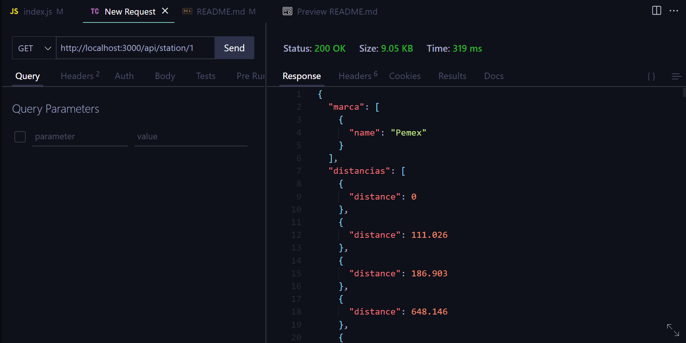
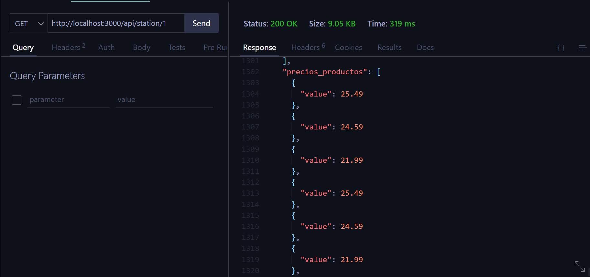
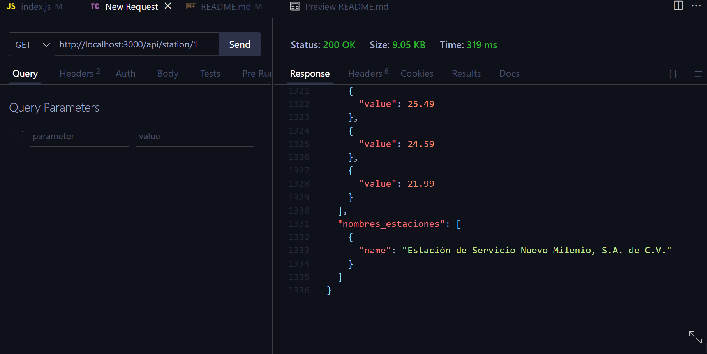

# Prueba técnica GASPRE

## Endpoint para recuperar usuarios de una base de datos

### Requerimientos
- Node.js version 18.15.0 (Se recomienda usar nvm para el manejo de distintas versiones)
- npm version 9.5.0

### Instalación
1. Clonar el proyecto:

```bash
git clone https://github.com/JesusdlaCruz/Prueba.git
```
2. Moverse hacia el directorio del proyecto:
```bash
cd Prueba
```
3. Instalar las dependencias:
```bash
npm install
```
### Uso

1. Ejecutar el siguiente comando para iniciar el servidor:
```bash
npm run dev
```
2. Abrir un navegador web o un cliente REST e ingresar la siguiente ruta:
```bash
localhost:3000/api/station/{id}
```
3. El resultado se mostrará de la siguiente manera:




Si tienes alguna duda, no dudes en enviar un correo a ju605385@gmail.com.
